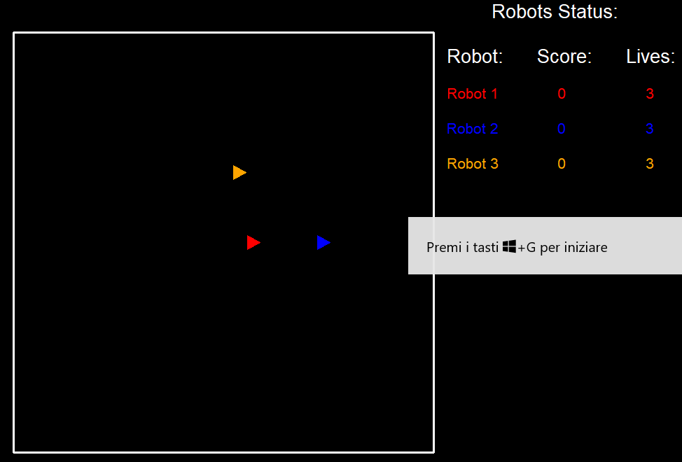

# Programming Robot Battle Game

*A programming game is a game based on computer programming. Unlike arcade type games which require human inputs controlling some object, all strategy in a Programming Robot Battle Game must be complete before the actual game begins. Game strategy is condensed into a language that the player will use to design and write their Robot AI.  Multiple Robots will battle against each other in a virtual arena. Only one will win.*

The game is developed in python programming language

## Game Description:
#### Battle Field:
The game screen is developed through the Turtle module of python. It is a 600 x 600 screen whose center has coordinates (x = 0,y = 0). The scores, lives and messages for each robot are shown in the right corner of the screen. The Battle Field is shown in the figure below.


#### Robot:
- Each robot is characterised by its own AI. The Robot AI determines the behaviour of the robot, in terms of movement and how often it shoots a missile
- Each robot has 3 lives and starts with 0 score

#### Missile:
Each robot can shoot a missile if and only it is "Ready", that is if the previous one shooted has reached the border of the battle field

#### Collision:
Two types of collision are handled
- collision R-R: it happens when two robots are in the same position on the battle field. Both of them lose 50 scores and reappears in a randomic position with coordinates in the range x = (-250,250) and y = (-250,250). If the number of R-R collisions of a robot reaches 2, the robot loses 1 life
- collision R-M: it happens when the missile of a robot and another robot are in the same position on the battle field. The robot hit by the missile loses 100 scores and 1 life and reappears in a randomic position with coordinates in the range x = (-250,250) and y = (-250,250), while the robot that shooted the missile acquires 100 scores and 1 life

#### Losers and Winners
- A robot dies if its number of lives becomes 0. In this case the robot disappears from the screen and the message "GAME OVER" appears
- The game stops when just one robot stays alive. When this happens the last robot stops on the battle field and the message "WINNER" appears

#### Files:
The repository contains 5 files .py. 
- main.py: it contains the classes used to create the objects of the game and the infinite while loop in which the Robot AI are executed. **Run this file to start the game**
- CreateObjects.py: here the game and the robots (3 in this case) are created. The characteristics of each color (color, "shape", starting position) are set
- HandleCollisions.py: here the functions collision_RR and collision_RM are used to handle respectively the collision between two robots and the collision between a robot and a missile. All the combinations are hadled
- Robot AI: Each Robot AI is a separated files. It determines the robot behaviour in terms of movement and how often it shoots a missile
  1. Robot1_AI: It moves with a speed of 30. When it hits the battle field borders it bounces with a randomic angle in the range (0°,360°). It shoots the missile in a randomic instant in the range (0,100) of the while loop, after the previous missile 
  2. Robot2_AI: it moves with a speed of 20. When it hits the battle field borders it bounces with 60°, that changes sign after 50 cicles of the while loop. It shoots the missile at multiples of 10 cicles.
  3. Robot3_AI: it moves with a speed of 10. When it hits the battle field borders it bounces with 30°. At multiples of 10 cicles it performs a right rotation of 45°. It shoots the missile at multiples of 5 cicles.
  
  #### How to create new Robots AI:
  - in CreateObjects.py: 
    - row 8: put robotNum = "number of robots in the game"
    - from row 47: create the new objects:
      ```# Create Robot i
      nameRi = "Robot i" # name of the roboti
      colorRi = "green" # color of the roboti
      xpos_roboti = 10 # x position of the roboti
      ypos_roboti = 30 # y position of the roboti
      ypos_scorei = 50 # y position of the roboti messages 
      roboti = Robot(shape, colorRi, xpos_roboti, ypos_roboti) # create Robot object for roboti
      scorei = RobotStatus() # create the RobotStatus object for the score
      scorei.show_RobotStatus(nameRi, 320, ypos_scorei, colorRi, game) # show the roboti messages
      missilei = Missile(shape, colorM, 0, 0) # create the Missile object for missilei```
- create Roboti_AI.py: the file has to contains the behaviour of the new robot. You can use the functions:
  - move(angle, game) to determine the bouncing angle of the robot
  - rotate(angle, game) to make the robot performs right rotation
  - roboti.speed = "desired speed of roboti" to change the speed of roboti
  - etc...
  
- in main.py:
  - row 239: ```ruby execfile("Robot3_AI.py")```
- in HandleCollisions.py:
  - call the functions collision_RR and collision_RM in order to handle all the combinations between robot-robot and robot and missile collisions
